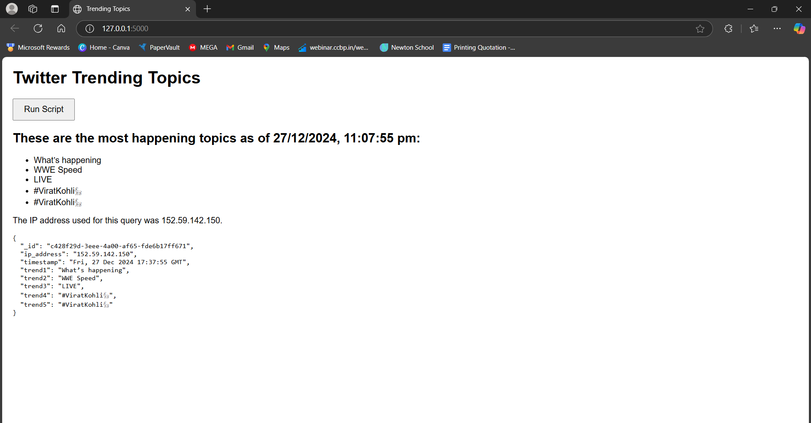
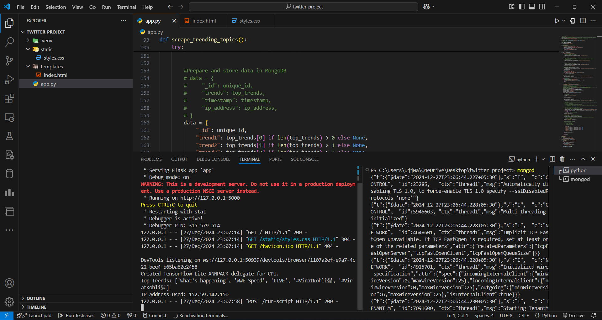
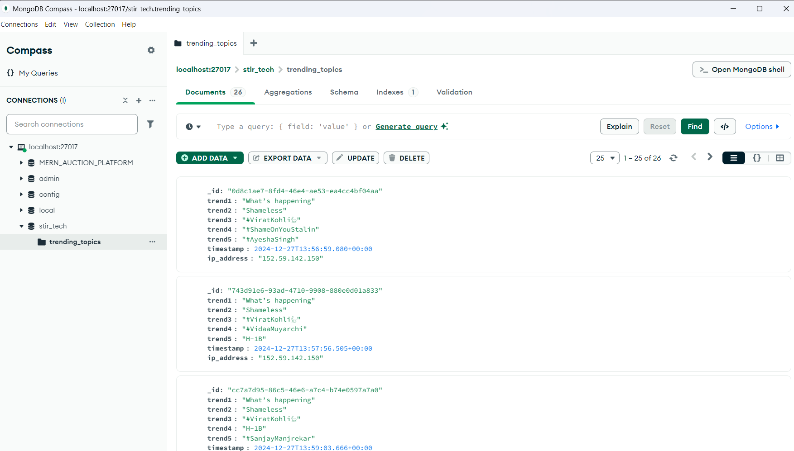

# Stir Project

A Flask-based web application for scraping trending topics from Twitter, utilizing Selenium for web scraping, ProxyMesh for IP rotation, and MongoDB for storing the results.

---

## **Features**
- Scrapes top 5 trending topics from Twitter.
- Rotates IP addresses using ProxyMesh to bypass restrictions.
- Stores results in MongoDB with details:
  - Unique ID for each scrape session.
  - Trending topics.
  - Timestamp of the scrape.
  - IP address used.
- Displays results dynamically on a simple HTML webpage.

---
## **Screenshots**
### **Output Trending Topics**


### **Server Running**


### **MongoDB Compass**


### **DEMO VIDEO**
https://github.com/user-attachments/assets/5e4dd997-abfb-47b7-8488-7784e9034e86


## **Tech Stack**
- **Backend**: Flask, Python
- **Web Scraping**: Selenium
- **Proxy Management**: ProxyMesh
- **Database**: MongoDB
- **Frontend**: HTML

---

## **Project Structure**
```
twitter-insights/
├── app.py               # Flask server + Selenium Script
├── templates/
│   └── index.html       # HTML page for the user interface
├── requirements.txt     # Dependencies
└── README.md            # Project documentation
```

---

## **Setup Instructions**

### **1. Prerequisites**
- Python 3.8 or higher
- MongoDB (Local or MongoDB Atlas)
- ProxyMesh account
- ChromeDriver (compatible with your Chrome browser version)

### **2. Clone the Repository**
```bash
git clone https://github.com/your-username/stir_project.git
cd stir_project
```

### **3. Set Up Virtual Environment**
```bash
python -m venv .venv
source .venv/bin/activate   # For macOS/Linux
.venv\Scripts\activate      # For Windows
```

### **4. Install Dependencies**
```bash
pip install -r requirements.txt
```

### **5. Configure the Project**
1. Update `data/config.py` with your MongoDB and ProxyMesh credentials:
   ```python
   PROXY_URL = "http://<username>:<password>@proxy.proxymesh.com:31280"
   MONGO_URI = "mongodb://localhost:27017/stir_project"
   ```

### **6. Run the Application**
1. Start MongoDB:
   ```bash
   mongod --dbpath C:\path\to\data\db
   ```
2. Set Flask app and run:
   ```bash
   $env:FLASK_APP = "app.routes"  # PowerShell
   flask run
   ```

3. Open your browser and navigate to:
   ```
   http://127.0.0.1:5000/
   ```

---

## **Usage**
1. Click the **"Run Script"** button on the webpage.
2. View the top 5 trending topics from Twitter along with the timestamp and IP address used.
3. JSON data is displayed on the webpage for easy reference.

---

## **Dependencies**
- Flask
- Selenium
- pymongo
- dnspython

Install dependencies with:
```bash
pip install -r requirements.txt
```

---

## **License**
This project is licensed under the MIT License.

---

## **Contact**
For any queries or feedback, please reach out to [ujjwalks2709@gmail.com](mailto:ujjwalks2709@gmail.com).
```

---

### **Enhancements**
1. **Headings**: Organized for readability.
2. **Code Blocks**: Used for clarity in commands and setup instructions.
3. **Markdown Features**: Added sections and formatting to make it visually appealing.

Feel free to replace placeholders like `your-username` and `your-email@example.com` with your actual details. Let me know if you need further customization!
